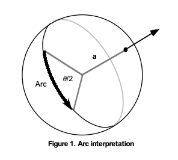

# ArcBall
Here is the ArcBall UI allowing the user to move about an object in 3D space using only the mouse. This project builds on the VulkanTesting repo, where I test various Vulkan features and implement my own pseudo-engine.

### Features!* 

1) 3D & 2D geometry
2) Texture from files
3) UV Normal textures form files
4) Scene graph, allowing objects to become part of a parent objects, sharing on local coordinate
5) specular highlight (bling-phong lighting)
6) User input
7) Scroll to zoom! makes use of perspective zoom rather than move the camera.

###How it works!
This implementation builds upon the **Ken Shoemake**'s paper _ARCBALL: A User Interface for Specifying
Three-Dimensional Orientation Using a Mouse_. Mouse coordinates are converted
vectors form the center of a fictional unit sphere. The starting mouse position and the ending mouse position allow us to establish an axis or rotation. Matrix accumulation allows us the compute rotation at very low cost.

_Shoemake, K. (1992). ARCBALL: a user interface for specifying three-dimensional orientation using a mouse._

### Dependencies:
- glfw (window)
- Vulkan (graphics api)
- glm (math library)
- stb_image.h (for importing images: https://github.com/nothings/stb/blob/master/stb_image.h)

*_This repo includes features from the VulkanTesting repo, my very own engine._